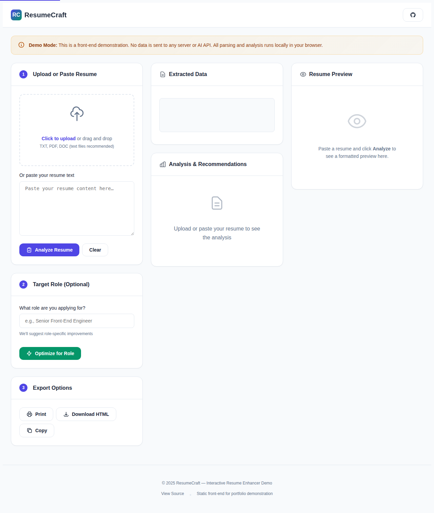
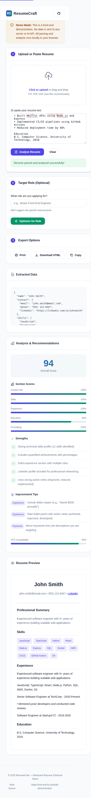

# ResumeCraft — Interactive Resume Enhancer

<p align="center">
  <strong>A modern, ATS-friendly resume analyzer built with vanilla JavaScript</strong>
</p>

<p align="center">
  <a href="#features">Features</a> •
  <a href="#demo">Demo</a> •
  <a href="#how-it-works">How It Works</a> •
  <a href="#ux-decisions">UX Decisions</a> •
  <a href="#ats-rules">ATS Rules</a> •
  <a href="#screenshots">Screenshots</a> •
  <a href="#technical-skills">Skills Demonstrated</a>
</p>

---

## Why ResumeCraft?

Job seekers face a critical challenge: **75% of resumes never reach human eyes** because they fail Applicant Tracking System (ATS) scans. ResumeCraft helps candidates understand:

- ✅ How their resume scores against common ATS criteria
- ✅ Which sections need improvement
- ✅ Specific, actionable tips for optimization
- ✅ How their formatted resume will appear to recruiters

**No sign-up required. No data leaves your browser. 100% client-side.**

---

## Features

### 📄 Resume Analysis
- **Smart parsing** extracts name, contact info, skills, experience, and education
- **Skill categorization** groups abilities by type (languages, frontend, backend, etc.)
- **Quantified achievement detection** identifies metrics and impact statements

### 📊 Scoring System
- **Overall score** (0-100) based on content completeness
- **Section scores** for Contact, Skills, Experience, Education, and Formatting
- **ATS compatibility score** checks for machine-readable formatting

### 💡 Improvement Recommendations
- **Strengths identified** with specific details
- **Weaknesses highlighted** with priority levels
- **Actionable tips** organized by resume section

### 🎯 Role Optimization
- Enter a target job title
- Receive role-specific skill suggestions
- See optimized resume preview

### 📱 Responsive Design
- Mobile-first approach
- Touch-friendly interactions
- Adapts to tablet and desktop layouts

### ♿ Accessibility
- WCAG 2.1 compliant
- Full keyboard navigation
- Screen reader support with ARIA labels
- High contrast color scheme

### 🖨️ Export Options
- Print-optimized layout
- Download as HTML file
- Copy to clipboard

---

## Demo

**Live Demo:** [https://epetaway.github.io/ResumeCraft-ghpages/](https://epetaway.github.io/ResumeCraft-ghpages/)

> 💡 **Demo Mode**: This is a front-end demonstration. All processing happens in your browser—no data is sent to any server.

---

## How It Works

### Resume Parsing

The parser uses pattern matching to extract structured data:

```javascript
// Example: Skill extraction using regex patterns
const SKILL_PATTERNS = {
  languages: ['JavaScript', 'TypeScript', 'Python', ...],
  frontend: ['React', 'Vue', 'Angular', 'Tailwind', ...],
  backend: ['Node.js', 'Express', 'Django', ...],
  // ... more categories
};
```

### Scoring Algorithm

The overall score is calculated from multiple factors:

| Factor | Max Points | Description |
|--------|-----------|-------------|
| Base Score | 40 | Starting point for all resumes |
| Skills | 20 | +2 points per identified skill |
| Experience | 15 | +3 points per experience entry |
| Contact Info | 10 | Email, phone, LinkedIn |
| Quantified Impact | 10 | Metrics like "25%", "$50K" |
| Action Verbs | 5 | ATS-friendly keywords |

### Pseudo-AI Analysis

Loading animations simulate AI processing while the analysis runs:

```javascript
const LOADING_MESSAGES = [
  'Scanning resume structure…',
  'Extracting key information…',
  'Analyzing skills and experience…',
  'Checking ATS compatibility…',
  'Generating recommendations…',
];
```

---

## UX Decisions

### 1. Progressive Disclosure
Users see a clean interface with three clear steps. Analysis details appear only after parsing, preventing cognitive overload.

### 2. Immediate Feedback
Every action provides visual feedback:
- Loading spinners during processing
- Color-coded status messages
- Progress bars for section scores

### 3. Mobile-First Approach
The layout uses a responsive grid that:
- Stacks vertically on mobile
- Shows 2 columns on tablet
- Displays 3 columns on desktop

### 4. Trust Through Transparency
The demo banner clearly states that no data leaves the browser, building user confidence for a sensitive task like resume editing.

### 5. Accessible by Default
- Skip links for keyboard users
- Focus indicators on all interactive elements
- ARIA labels for screen readers
- High contrast text (4.5:1 minimum ratio)

---

## ATS Rules

ResumeCraft follows these ATS-friendly best practices:

### ✅ Format Rules
- Use standard section headings (Experience, Skills, Education)
- Avoid tables and complex layouts
- Stick to common fonts and ASCII characters
- Keep file format simple (TXT preferred, PDF acceptable)

### ✅ Content Rules
- Include keywords from job descriptions
- Use action verbs (achieved, implemented, developed)
- Quantify achievements with numbers
- Match exact job titles when applicable

### ✅ Technical Rules
- No special characters or emojis in content sections
- Avoid headers/footers (often ignored by ATS)
- Use standard date formats
- Keep formatting consistent

---

## Screenshots

### Upload Screen

*Clean interface with drag-and-drop file upload and text paste options*

### Analysis Results

*Detailed scoring with progress bars and actionable recommendations*

### Mobile View

*Fully responsive design optimized for touch interactions*

---

## Technical Skills Demonstrated

This project showcases:

### Front-End Development
- **Vanilla JavaScript** — No frameworks, demonstrating core language proficiency
- **Modern ES6+** — Arrow functions, async/await, destructuring, optional chaining
- **DOM manipulation** — Efficient element selection and dynamic rendering
- **Event handling** — Keyboard navigation, drag-and-drop, file uploads

### CSS & Design
- **Custom properties** — Themeable design system
- **Flexbox & Grid** — Responsive layout system
- **Animations** — Smooth transitions and loading states
- **Print styles** — Proper media queries for printing

### Code Quality
- **ESLint + Prettier** — Consistent code formatting
- **Modular architecture** — Separated concerns (parsing, analysis, rendering)
- **Error handling** — Graceful degradation and user feedback
- **Documentation** — JSDoc comments and clear naming

### Accessibility
- **WCAG 2.1 AA** — Color contrast, focus management, ARIA
- **Keyboard navigation** — Full functionality without a mouse
- **Screen reader support** — Semantic HTML and live regions

### UX Engineering
- **Progressive enhancement** — Works without JavaScript for basic content
- **Performance** — No external dependencies in production
- **Loading states** — Clear feedback during async operations
- **Error states** — Helpful messages for user errors

---

## Run Locally

```bash
# Clone the repository
git clone https://github.com/Epetaway/ResumeCraft-ghpages.git

# Navigate to directory
cd ResumeCraft-ghpages

# Install development dependencies (optional)
npm install

# Open in browser
open index.html
# or use a local server
npx serve .
```

---

## Development

```bash
# Lint JavaScript
npm run lint

# Fix linting issues
npm run lint:fix

# Format all files
npm run format
```

---

## Deploy to GitHub Pages

This repo includes a GitHub Actions workflow for automatic deployment:

1. Push to the `main` branch
2. In **Settings → Pages**, set **Source** to **GitHub Actions**
3. Your site will be live at `https://<username>.github.io/ResumeCraft-ghpages/`

---

## Project Structure

```
ResumeCraft-ghpages/
├── index.html              # Main HTML file
├── src/
│   └── app.js              # Application logic
├── styles/
│   └── main.css            # Custom styles
├── assets/
│   └── screenshots/        # UI screenshots
├── package.json            # npm configuration
├── eslint.config.mjs       # ESLint configuration
├── .prettierrc             # Prettier configuration
└── README.md               # This file
```

---

## License

MIT License — See [LICENSE](./LICENSE) for details.

---

<p align="center">
  <strong>Built with ❤️ to help job seekers land their dream roles</strong>
</p>
